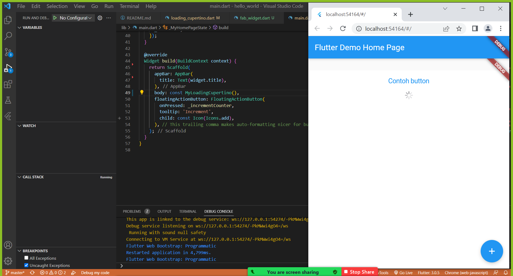
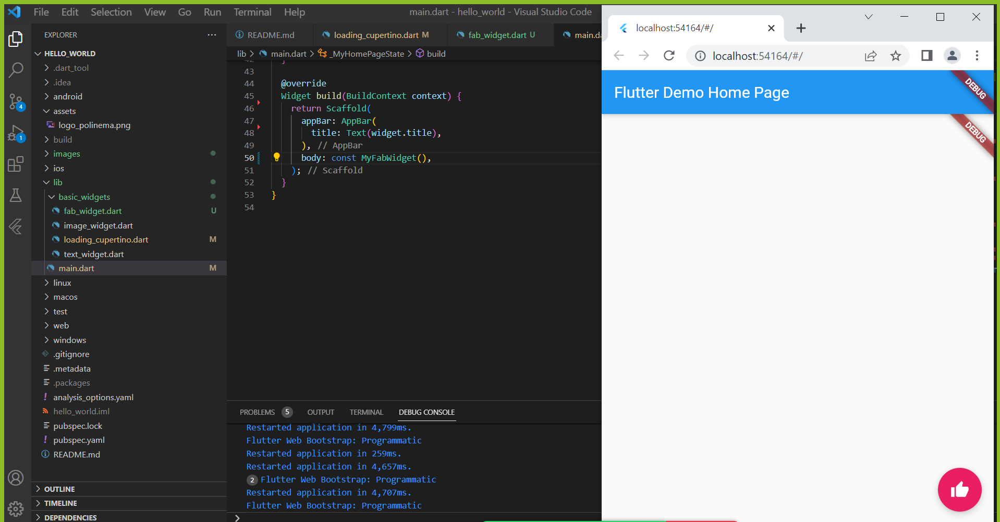
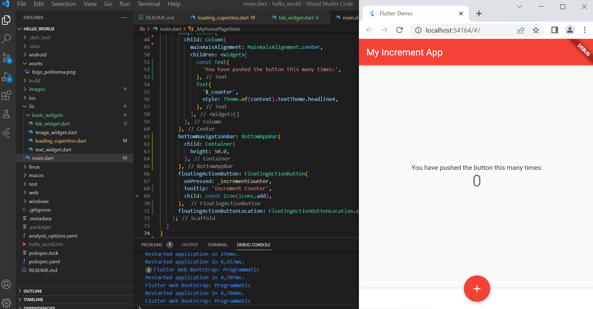
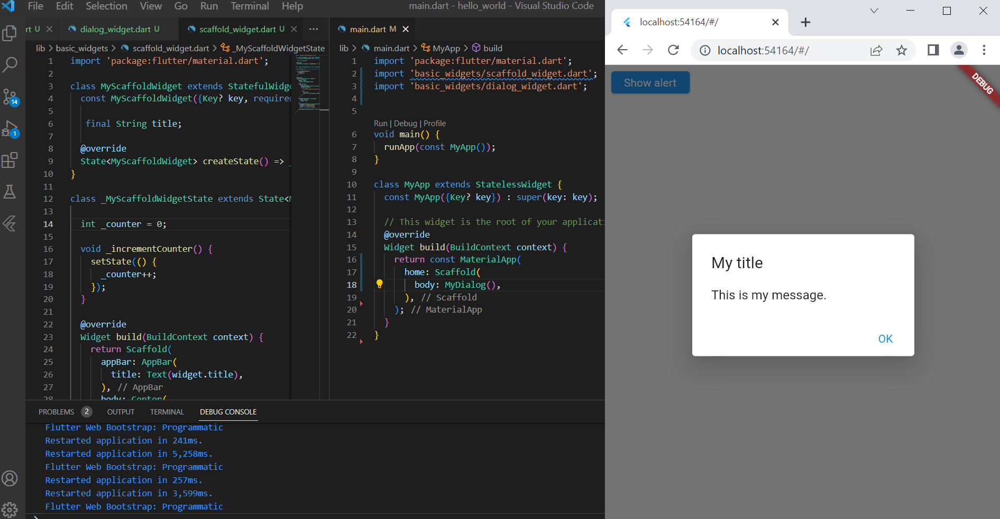
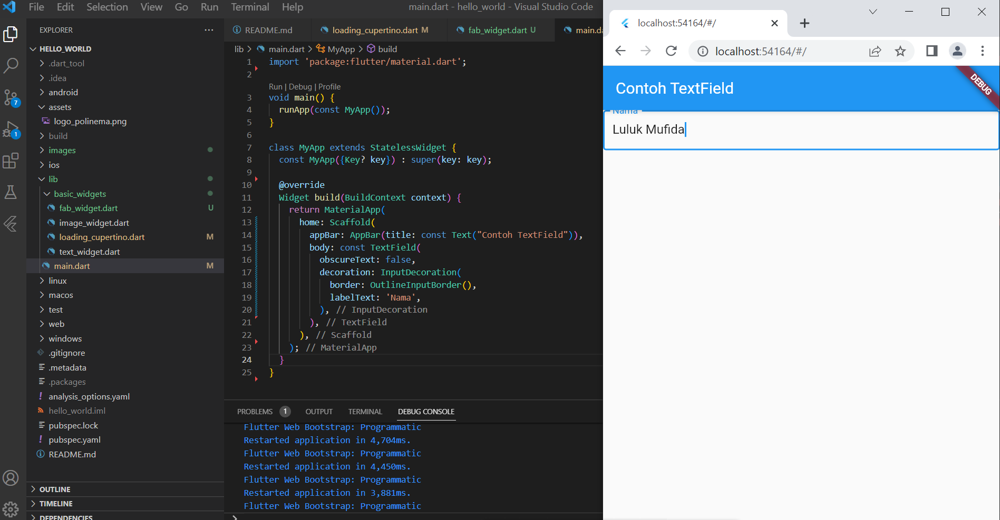
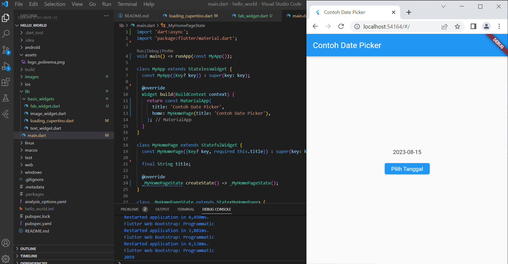
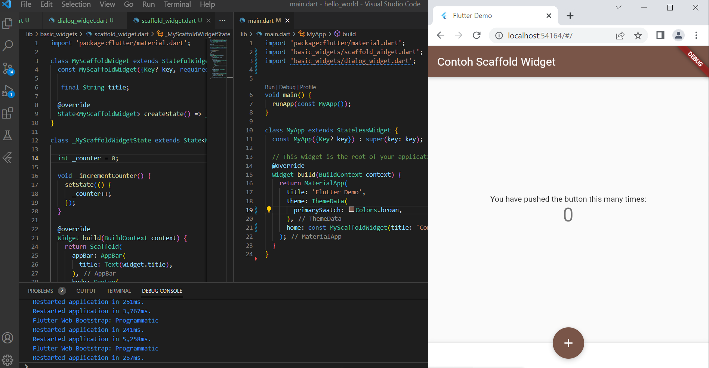
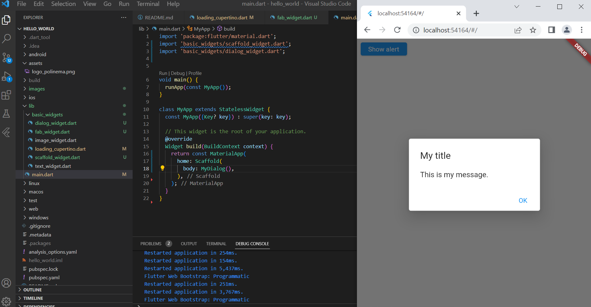
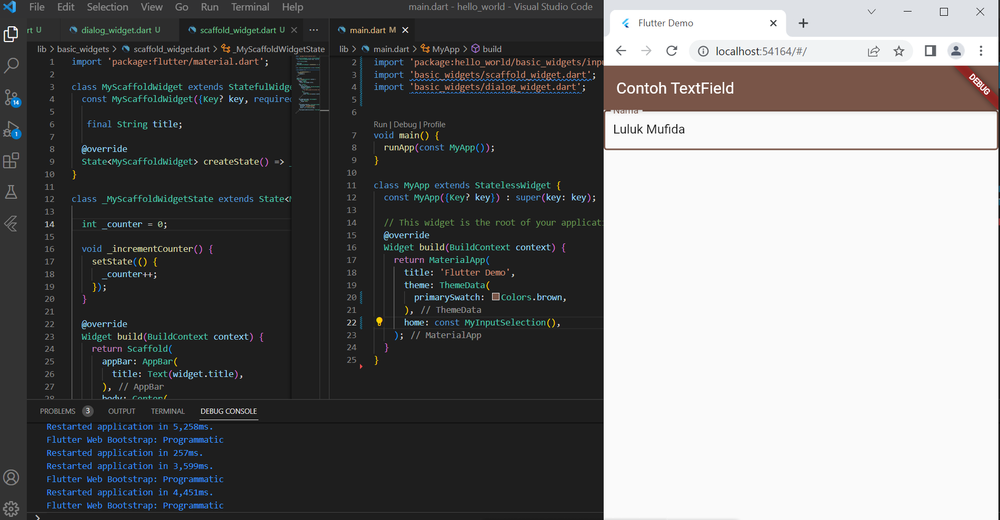
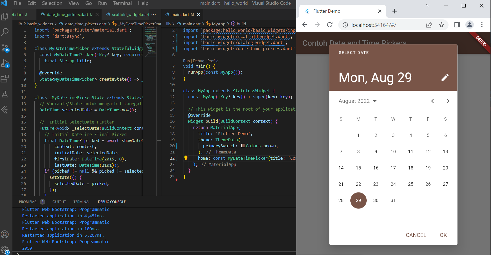

# Praktikum 1 dan 2 Membuat Project Baru dan Membuat Laporan Praktikum

## hello_world

A new Flutter project.

# Praktikum 3: Menerapkan Widget Dasar

## 1. Text Widget

## 2. Image Widget

# Praktikum 4: Menerapkan Widget Material Design dan iOS Cupertino

## 1. Cupertino Button dan Loading Bar

## 2, Floating Action Button (FAB)

## 3. Scaffold Widget

## 4. Dialog Widget

## 5. Input and Selection Widget

## 6. Date and Time Pickers

# Tugas Praktikum 16

Pada praktikum 4 mulai dari Langkah 3 sampai 6, buatlah file widget tersendiri di folder basic_widgets, kemudian pada file main.dart cukup melakukan import widget sesuai masing-masing langkah tersebut!

## Langkah 3: Scaffold Widget

## Langkah 4: Dialog Widget

## Langkah 5: Input and Selection Widget

## Langkah 6: Date and Time Pickers

