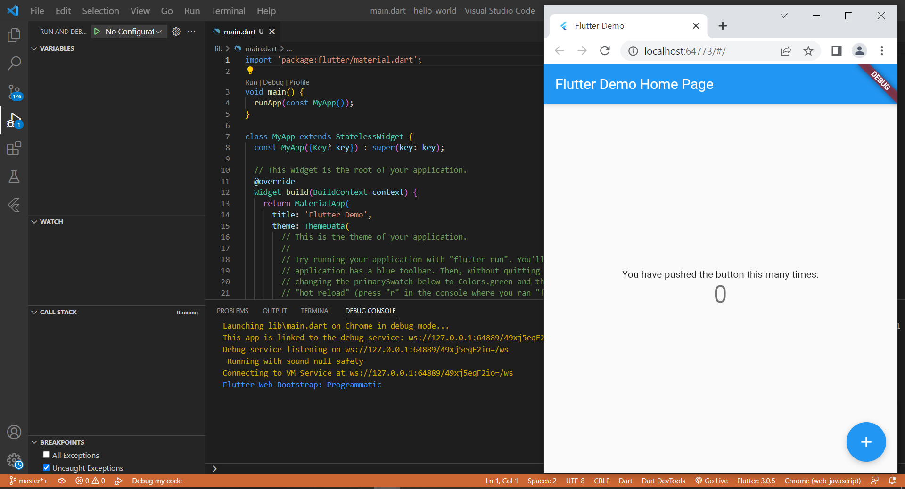
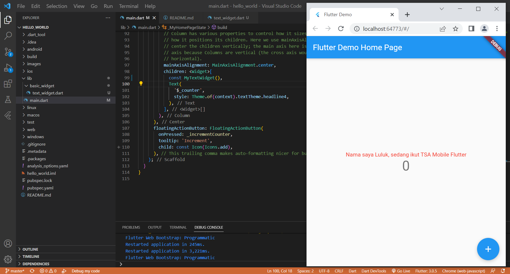
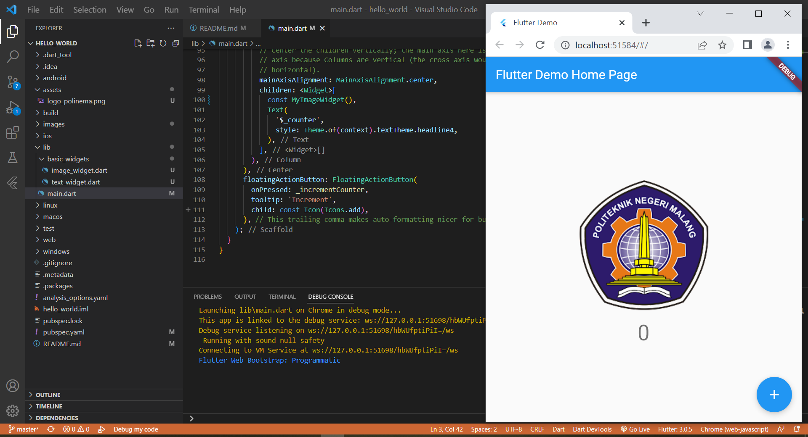

# Praktikum 1 dan 2 Membuat Project Baru dan Membuat Laporan Praktikum

## hello_world

A new Flutter project.

# Praktikum 3: Menerapkan Widget Dasar

## Text Widget

## Image Widget

# Praktikum 4: Menerapkan Widget Material Design dan iOS Cupertino